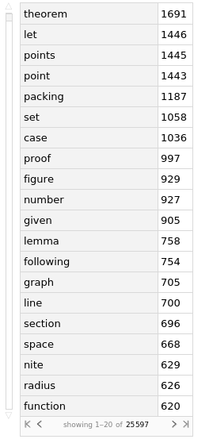

## Correlating Concepts with Math Formulas

- The idea of the project was to find concepts that have the highest co-occurrence with specified Mathematical keywords. The data was scraped from the arXiv API, and the highest occurring words were found using regular expressions and processed using basic natural language processing. 

